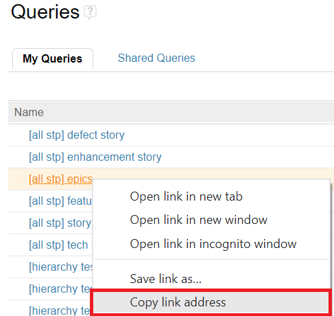

# RTC-ADS-Migration-Tool
Migrate work items from IBM RTC (Rational Team Concert) to ADS (Azure DevOps)

## Introduction 
This project is a Python script which migrates work items from IBM RTC to Microsoft Azure DevOps and links parent/child hierarchy.

It uses the [Azure DevOps Python API](https://github.com/Microsoft/azure-devops-python-api) and a specific fork of [rtcclient Python package](https://rtcclient.readthedocs.io/en/latest/quickstart.html#) which works with older versions of RTC in order to perform operations via REST API.

## This script currently supports migrating the following RTC Work Item Types:
- Epic
- Feature
- Story
- Defect Story
- Documentation Story
- Enhancement Story
- AST Story
- Assessment Story
- Defect Story
- SIT Story
- Technical Spike

Support for more work items can be added in the CONFIG.py file

# Setup

## Python
- **Python 3.8.1** was used during development
All dependencies are mentioned in the file scripts/requirements.txt. 
In order to install the dependencies, run this command:
```
pip install -r scripts/requirements.txt
```

## rtcclient
- This repo uses a custom version of the rtcclient Python package based on version 0.6.0 which fixes an authentication error and adds some custom functions such as "getUserEmail(userId)". 
To install this package locally, remove rtcclient if you already have it installed, and install the `rtcclient-custom` folder located in this repo by running the following commands:
```
    $ git clone https://github.com/philips-forks/rtcclient rtcclient-philips 
    $ cd ..
    $ pip uninstall rtcclient
    $ pip install -e ./rtcclient-philips/
```

## Config file auth variables
Take the template ex_CREDENTIALS.py file, fill out the values, and rename it as `CREDENTIALS.py` In order to run this repo you will need to fill out the following varaible values:
```
# RTC Auth Creds
RTC_USERNAME = "" # mypassword123
RTC_PASSWORD = "" # myusername

# Azure DevOps Auth Creds
personal_access_token = ""

# RTC input location (STP ULT)
RTC_URL = "" # https://rtcus1.ta.mycompany.com/ccm
RTC_projectarea_name = "" # "PROJECTARENAME"

# ADS output location
organization_url = '' # https://dev.azure.com/ADS-Org-Name
ads_project_name = '' # "Project-Name"

# RTC input email domain 
user_domain = "" # "@companyname.com"

```
## Inputs
Currently there are two accepted input methods. RTC Query URLs, and a CSV file input. To enable one of these inputs, change this code in the `scripts/CONFIG.py` file:
```
###################################
# Input Method (only one can be true at a time)
###################################
csv_input = False 
csv_filepath = "csv_input\\frups ex.csv"
rtc_query_url_input = True 
```
## Input method 1 RTC Query Urls
Get RTC query URL's by copying the query link online like so:<br>

<br>
Make sure your RTC Queries only query for one RTC Work Item Type at a time, so you have queries for Epics, queries for Features, etc.
Paste your Query URLs (separated by commas) inside the CONFIG rtc_query_urls object like so:
```
rtc_query_urls = {
    'epic':[
        "queryURL1",
        "queryURL2",
        "queryURL3",
        
    ], 
    'feature':[
      'queryURL1'
    ],
    ...
}
```
## Input method 2: CSV input
Download a CSV file from the RTC query view, make sure all columns are selected. Save this CSV file inside the `csv_input` folder, and add the csv filename to `csv_filepath` inside `scripts/CONFIG.py`

## Area / Iteration Path Mapping
Before you run a migration it is important to check your Azure DevOps project output to see what options are available for Area / Iteration Path:
<br>

<br>
You will want to make sure that the values for `Planned For` in your RTC query URLs will be able to get brought over to ADS:


<br>

# Running a migration
Once your CONFIG file variables are all filled out, run a migration by running the file:
```
python scripts/migration.py
```
This file will migrate every work item from your query URLs inside `rtc_query_urls`, it will format ADS Attributes using RTC Properties specified in the `work_items_property_map` CONFIG var. 

Once each RTC Work Item has been migrated to Azure DevOps, the script will link every parent/child hierarchy between the migrated work items.


# Devloping for this script:

## How to view all fields in Azure Ticket:
- Get orgnization, project, and work item id, add to url like so to view all fields:
```
https://dev.azure.com/{organization}/{project}/_apis/wit/workitems/{id}?$expand=fields&api-version=7.1-preview.3
```
Example URL to view all fields in Azure DevOps work item with ID = 826:

https://dev.azure.com/proj/ULT/_apis/wit/workitems/826?$expand=fields&api-version=7.1-preview.3


## How to view all fields in RTC Ticket
- Go to url formatted like this with the RTC Work ID at the end to see xml data:

https://rtc_url/ccm/oslc/workitems/168082

Use this view to search for RTC Property values such as `rtc_cm:targeted_release`


## How to run the Python rtcclient package from your terminal:
```
pip uninstall rtcclient
pip install -e .\rtcclient-custom\
python
>>> from rtcclient.utils import setup_basic_logging
>>> from rtcclient import RTCClient
>>> setup_basic_logging()
>>> myclient = RTCClient("RTC_URL", "RTC_USERNAME", "RTC_PASSWORD", ends_with_jazz=False)
>>> myclient.getWorkitem("work item id")
>>> myclient.getUserEmail("rtc user id")
```

# How to delete created Azure tickets:
- Go to organization / project search page:
`https://dev.azure.com/{organization}/{project}/_workitems/recentlycreated/`
- Search for tag 'RTC-Migration', change filter to search for 'Recently created' and 'Recently completed', select multiple, click on row options, delete.

# rtcclient-custom 
- Started with rtcclient v0.6.0
- Added the following code to the base.py file before `response = requests.get(url`:
```
        requests.packages.urllib3.disable_warnings()
        requests.packages.urllib3.util.ssl_.DEFAULT_CIPHERS += ':HIGH:!DH:!aNULL'
        try:
            requests.packages.urllib3.contrib.pyopenssl.util.ssl_.DEFAULT_CIPHERS += ':HIGH:!DH:!aNULL'
        except AttributeError:
            # no pyopenssl support used / needed / available
            pass
```
- Added the following functions to client.py:
  - getUserEmail()
  - getFeaturePlannedForValue()
  - getTeamTrackBool()
  - getChildrenInfo()